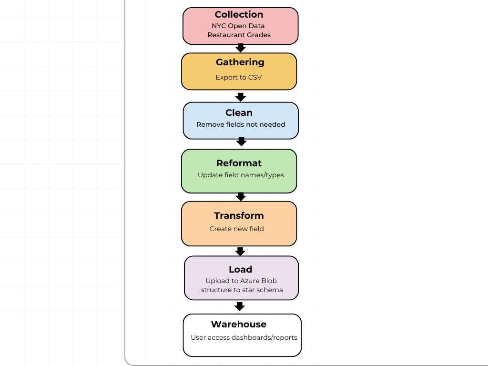
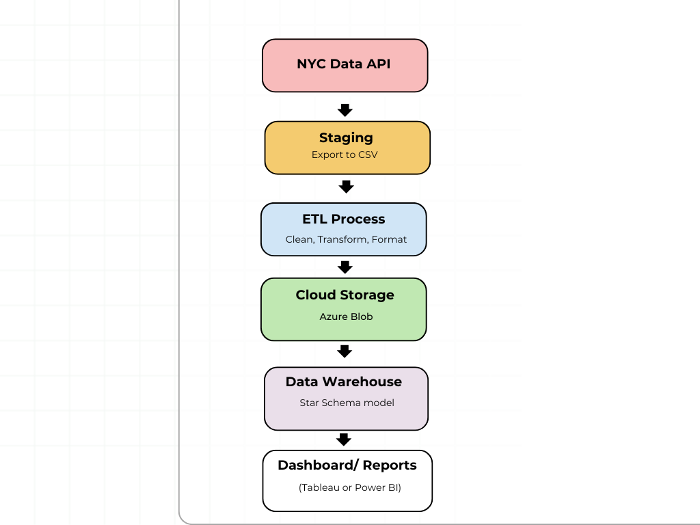
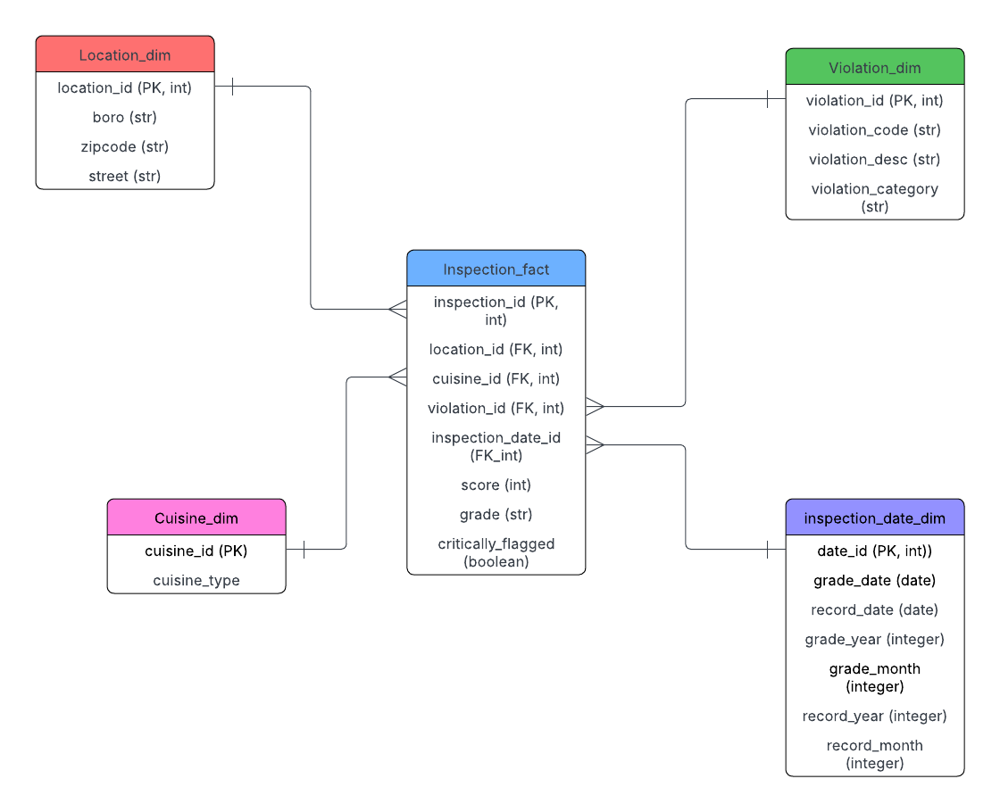

## NYC Restaurant Grades 
With the NYC Restaurnt Grades daset, my data warehouse will aim to achieve the following business Requirements 

## Business Requirements

1. Identify NYC high risk areas based on Restaurant Grades 

 The data warehouse will help identify hotspots based on zip codes/ neighborhoods, where restaurants are consistently receiving grades less than an "A". 
 
 This would serve as a guide to NYC health inspectors in where to prioritize inspections and bring community awareness to create efforts around food safety/handling.

2. Analyze common factors influencing inspection grades 

Looking at the data and being able to parse through violation descriptions will give insight to some of the following questions: 

-   What are the most common violations/mistakes restaurants are making?
-   What violations are most associated with with receiving a "C" or "B".

This requirement will mainly focuse on the question, "How do I get my restaurant from a "C" to a "B" to an "A"?" This would be valuable to restaurant owners. 

3. Identify reccurring violations within different cuisine types
    Analyzing different inspection records to see if certain cuisine types have a commonality in specific violations.

This can help different restaurant ownders, food satefy educators, and restaurant consultants improve their operations and reduce the risk of violation. 

## Functional Requirements 

The following functional requirements are needed to help support in identifying high risk areas and analyzing factors that influence inspection grades: 

1. Aggregate grades by Location 
    The data warehouse would allow users to query inpsection grades by zip code and their neighborhoods to see which areas are considered high risk for grades less than an "A". 

2. Parse and Categorize Violations 
    The data warehouse must be able to extract and categorize violation descriptions to be able to identify all violations and then categorize to their most common violations across the city. 

3. Correlation from violation to grade 
    The data warehouse mst be able to correlate which specific violations are associated with receiving grades below and "A". 

4. Violation commonalities within specific cuisine types 
    The data warehouse must be able to analyze violations by cuisine type and be able to recognize whether there is a pattern within a specific cuisine type.
   
## Data Requirements 
#   Source: 

I will be using the [NYC Open Data: Restaurant Grades dataset](https://data.cityofnewyork.us/Health/Restaurant-Grades/gra9-xbjk/data_preview), which is based on the Department of Health and Mental Hygiene (DOHMH). Each row in the dataset represents a restaurant inspection done by the NYC Department of Health. 

The key fields I will be focusing on in my warehouse will be: 

- DBA (Restaurant Name)
- Cuisine Description 
- Boro
- Zipcode 
- Violation Code 
- Violation Description 
- Grade 
- Score 

## Data Sourcing 
Web API sourcing can be found in data folder under the data_dictionary.ipynb file along with a word document with further details of the data dictionary sourced from the [NYC Open Data: Restaurant Grades dataset](https://data.cityofnewyork.us/Health/Restaurant-Grades/gra9-xbjk/data_preview). 

## Information Architecture 
# Overview 
The information architecture starts with the restaurant inspection data being soured from the dataset. The data flow will be in the following order

1. Collection: from the nyc open dataset
2. Gathering: The dataset will be exported into a csv file
3. Clean: remove fields that will not be useful in this analysis project (i.e. grade date, record date, building)
4. Reformat: Will be done after fields are dropped and file is updated
5. Transform: new fields would be created in this step (i.e. critically_flagged and violation_category)
6. Load: The clean and reformatted/transformed data will then be stored into azure blob and structured into star schema warehouse. 
7. Warehouse: users can access dashboards/reports

## Data Architecture 

Data Source: the data will be coming from the NYC Open Data: Restaurant Grades dataset

Data Storage: when the csv is exported, it will be then be stored in Microsoft Azure blob for storage as its staging location. This is where the raw data will be. 

ETL (Extract, Transform, Load): Fields not used will be dropped in this step. Using Pyhon/ SQL the data will become standardized/ renamed fields. Transformed by creating new fields.  

Cloud Storage/Warehouse: Azure blob + Star Schema 
After data is cleaned and uploaded into Azure it will be structured into a star schema into the cloud warehouse. 

Fact table: Inspections (score, grades, flags)
Dimension Tables:(Location, Cuisine, Violation Type)

Dashboard/ Reports: tools like tableau or power bi to access the data for dashboards/report. This will allow for users to see patterns within different zip codes, cuisines, and violations

## Dimensional Modeling

# Fact Table

inspection_id (PK) – Unique ID for the inspection
location_id (FK) – restaurant's location
cuisine_id (FK) – cuisine type
violation_id (FK) – specific violation recorded
inspection_date_id (FK) – inspection and record date
score – Numerical health inspection score
grade – Letter grade assigned to the restaurant (A, B, C)
critically_flagged – Boolean flag for critical violations

# Dimension Tables

Location_dim (PK)
boro - borough (Manhattan, Queens, Bronx, Staten Island, Brooklyn)
zipcode - zip code of restaurant 
street - street name of restaurant 

Cuisine_dim 
cuisine_id (PK)
cuisine_type (American, Chinese, Bakery)

Violation_dim
violation_id (PK)
violation_code - code given by NYC DOH
violation_desc - description of violation 
violation_category - classfied group (i.e. cleanliness, pest control, etc)

Inspection_date_dim 
date_id (PK)
grade_date - when the grade was given 
record_date - when the record was added 
grade_year + grade_month - values from grade_date that were parsed 
record_year + record_month - values from record_date that were parsed 